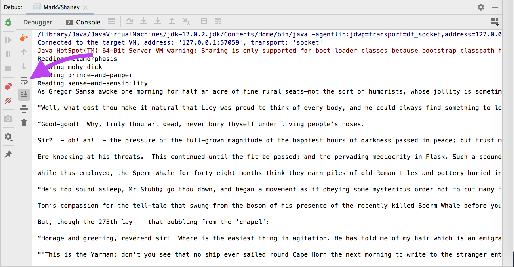
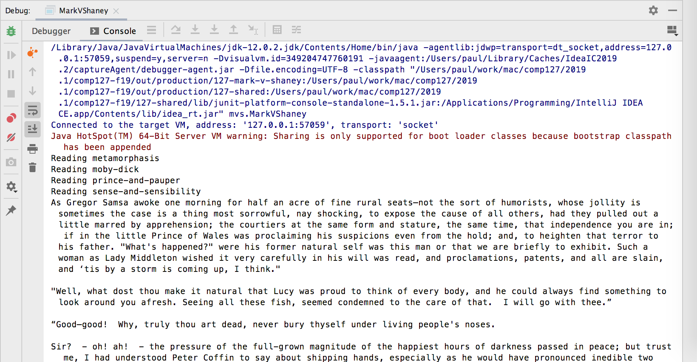

# Mark V. Shaney

## Background

Long ago, before social networking, before the web, dinosaurs roamed the earth — and one of those dinosaurs is [Usenet](http://en.wikipedia.org/wiki/Usenet). In the mid 80s, a user named Mark V. Shaney began posting to the Usenet group _net.singles_. His posts seemed on-topic, but curiously incoherent. An example:

<blockquote>When I meet someone on a professional basis, I want them to shave their
arms.  While at a conference a few weeks back, I spent an interesting evening
with a grain of salt.  I wouldn't dare take them seriously!  This brings me back
to the brash people who dare others to do so or not.</blockquote>

The irritated group members quickly figured out that this author was a prankster — but it took them a little longer to realize that he was not even a human. Mark V. Shaney was a simple artificial intelligence algorithm, unleashed on the poor members of _net.singles_ by mischievous researchers at [Bell Labs](http://en.wikipedia.org/wiki/Bell_labs). 

## The algorithm

Given that its output comes eerily close to making sense, and is often even grammatically correct, the algorithm is surprisingly simple. Mark V. Shaney (hereafter “MVS”) is a pun on “[Markov chain](https://en.wikipedia.org/wiki/Markov_chain).” MVS reads a body of input text, and makes a transition table that answers the following question: “Given a previous pair of words, what are the choices for the next word?”

For example, for the input string “Jack be nimble, Jack be quick”, MVS generates the following transition table:

<table>
  <tr><th align="left">[]</th> <td>→</td> <td>["Jack"]</td></tr>
  <tr><th align="left">["Jack"]</th> <td>→</td> <td>["be"]</td></tr>
  <tr><th align="left">["Jack", "be"]</th> <td>→</td> <td>["nimble", "quick"]</td></tr>
  <tr><th align="left">["be", "nimble"]<td>→</td> <td>["Jack"]</td></tr>
  <tr><th align="left">["nimble", "Jack"]</th> <td>→</td> <td>["be"]</td></tr>
</table>

Note that the table includes entries for _no words preceding_ (i.e. the very beginning of the text), and _one word preceding_ (the first word of the text).

Also note that MVS is case sensitive, and considers anything that is not a space to be part of a “word” — including line breaks and punctuation. This behavior allows it to form sentences and paragraphs.

Having built this table of information, MVS generates new text by looking up the last pair of words output, and randomly selecting the next word from the available options. If there are no options, it stops. For example, with the table above:

* The initial context is “” (i.e. nothing). In the table, the next word for that context is “Jack”, so that’s what MVS outputs.
* Now the context is “Jack”. The next word is “be”.
* Now the context is “Jack be”. For this context, MVS has _two_ choices: “nimble,” or “quick”. MVS randomly chooses one; let’s say it’s “quick”.
* Now the context is “be quick”. There is no next word in the table for this context, so MVS stops.

The algorithm can also use more or fewer preceding words in the Markov chain. The traditional context size is 2, but 1 and 3 also yield interesting results.

## Your task

We have given you a start on the Mark V. Shaney algorithm. Your job is to complete it.

You only need to add a little code to get it working, but **you must add tests** for your code.

First, study the existing code. Understand the classes and their relationships. Figure out how this object design is going to work.

Next, start adding tests. There is one example there already to help you get started. Below are some more to write. As you add each one new test:

- Make sure the new test fails.
- Implement just enough of the code to make it pass.
- Make sure it passes.
- Make sure **all** the older tests also still pass.
- Then and only then move on to the next one.

Tests to add:

- It **handles unrecognized context**: Given context that did not appear in the input text, `chooseNextWord` returns null. This is what happens at the end of the text.
- It **handle the initial context**: After reading the text "Hello there!", it returns "Hello" for an empty context, and "there!" for the context "Hello". This is what happens at the beginning of the text
- It **handles multi-word context**: After reading the text "one two three", it returns "three" for the context "one two".
- It **shifts words out of context**: After reading the text "one two three four",
  - it returns "four" for the context "two three", but
  - returns null for the context "one two three".
- It **respects the context size setting**: If you create a _new_ `MarkVShaney` object with a context size of 3 passed to the constructor, then after reading the text "one two three four",
  - it returns "four" for the context "one two three", but
  - returns null for the context "two three".
- It **handles multiple choices**: This is a tricky one to write, because you are testing random behavior. After reading the example text above, "Jack be nimble, Jack be quick", if you call `chooseNextWord()` over and over for the context "Jack be", you should eventually see both "nimble" and "quick" (and nothing else).
- It **generatesText**: It is not feasible to fully test the random behavior of the text generation. However, you can test that given input text which always produces only one choice for a given context, it will always generate the input string. In other words, after reading the text "Coding up a storm", if you call `generate()` and collect the results to a list, you should get `List.of("Coding", "up", "a", "storm!")`.

By the time you are done with these tests, you should have no more TODOs left in the source code!

All passing? Try running the `MarkVShaney` class. Its main method reads the text several classic books and scrambles them!

Note: IntelliJ might put each paragraph all on one line, with no line breaks. If you are seeing this, click the “soft wrap” button next to the output text:

 
